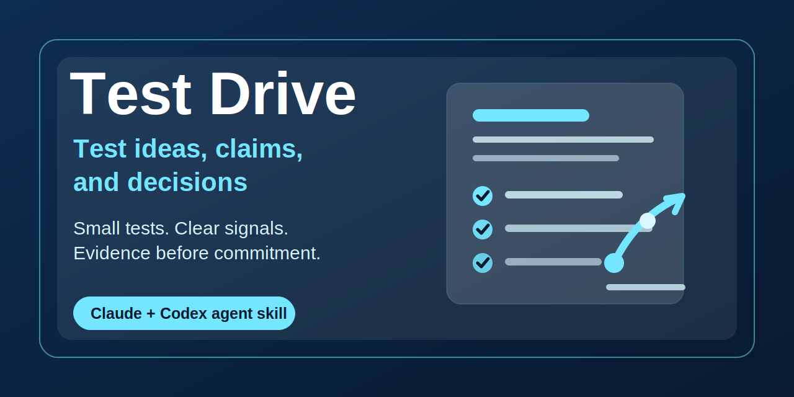

# Test Drive



Test an idea before you trust it.

Test Drive is an agent skill for Claude and Codex that helps people test an idea, claim, or decision before trusting it. It turns plausible beliefs, strategies, prompts, skills, messages, artifacts, and AI outputs into low-risk trials that can create useful evidence.

It helps people move from judgment to evidence-seeking action without overcommitting too early.

## Why this exists

AI can make almost any idea sound polished. That is useful, but dangerous when polish gets confused with proof.

Test Drive helps a human ask the next better question: what kind of evidence would actually make this more or less trustworthy? Sometimes the answer is a customer interview. Sometimes it is a dry run, a prompt eval, a small post, a cohort analysis, a regression, a connector, or another skill.

The point is not to prove the idea right. The point is to learn before committing.

## What it does

Test Drive helps identify:

- the idea, claim, decision, belief, or artifact being tested
- the evidence type that matters most
- the smallest credible test
- the artifact needed to run the test
- connectors, tools, data, or permissions required
- support and weaken signals
- what would change your mind
- the learning loop after the test

## Evidence types

Test Drive routes by evidence type instead of domain:

- **Human reaction:** interviews, surveys, messages, posts, prototype feedback
- **Behavioral / data:** cohort analysis, funnel analysis, segmentation, regression
- **Reasoning:** assumption audit, adversarial review, counterexample search
- **Expert judgment:** multi-lens review, scenario analysis, pre-mortem
- **Artifact performance:** dry runs, eval cases, rubric scoring, edge cases
- **Operational feasibility:** connector checks, permission scope, pilot workflows

## Install for Claude

Download `test-drive.skill` from the [latest release](../../releases), then add it through your Skills settings.

## Install for Codex

Ask Codex:

```text
Install my Test Drive skill from https://github.com/glichtenthal/test-drive
```

Or install manually:

```bash
python3 ~/.codex/skills/.system/skill-installer/scripts/install-skill-from-github.py \
  --repo glichtenthal/test-drive \
  --path . \
  --name test-drive
```

Restart Codex after installation.

## Manual install

The repository is the skill. Copy the complete folder into your agent's skills directory. For example, Codex discovers:

```text
~/.codex/skills/test-drive/SKILL.md
```

## Good first uses

```text
Use Test Drive on this product idea before I build anything.
```

```text
How could I test whether this positioning actually lands?
```

```text
Test drive this prompt before I reuse it.
```

```text
What data or connector would we need to validate this claim?
```

```text
Create the smallest useful test for this strategy.
```

## Try it in three minutes

Start with the worked quick demo:

- [Quick demo: design a small test for an onboarding complexity claim](examples/quick-demo.md)

It shows a realistic idea, a copy-paste prompt, the expected evidence-plan shape, and the artifact the agent can prepare next.

## How it fits with other skills

- **The Briefing Room** organizes messy context.
- **Ground Truth** pressure-tests the thinking.
- **The Quorum** deliberates consequential decisions.
- **Test Drive** tests an idea, claim, or decision before you trust it.

Together they support a judgment workflow: make the mess legible, challenge the reasoning, deliberate the stakes, then create evidence.

## More agent skills

- **[The Briefing Room](https://github.com/glichtenthal/briefing-room)** - turn messy context into a brief you can think with.
- **[Ground Truth](https://github.com/glichtenthal/ground-truth)** - calibrated honesty and anti-sycophancy for plans, decisions, reviews, and ideas.
- **[The Quorum](https://github.com/glichtenthal/the-quorum)** - a five-member expert council that pressure-tests consequential decisions from multiple angles.

## Build the `.skill` yourself

The repo is the skill. To create a local installable `.skill` file, zip the folder from its parent directory while excluding evals and local machine files:

```bash
cd path/to/parent
zip -r test-drive.skill test-drive \
  -x 'test-drive/evals/*' \
  -x '*/.DS_Store' \
  -x '*/__pycache__/*'
```

The official release asset is already packaged for install: [test-drive.skill](https://github.com/glichtenthal/test-drive/releases/latest).

## Repo layout

```text
test-drive/
├── SKILL.md
├── agents/
│   └── openai.yaml
├── assets/
│   └── social-preview.svg
├── evals/
│   └── evals.json
├── examples/
│   ├── README.md
│   ├── positioning-test.md
│   ├── data-analysis-test.md
│   └── skill-eval-test.md
├── README.md
├── CHANGELOG.md
└── LICENSE
```

## Version history

See [CHANGELOG.md](CHANGELOG.md).

## License

MIT - see [LICENSE](LICENSE). Use it, fork it, tune it for your own judgment workflows.
